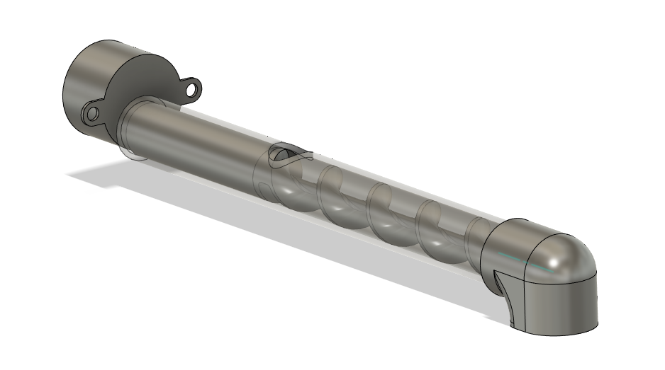
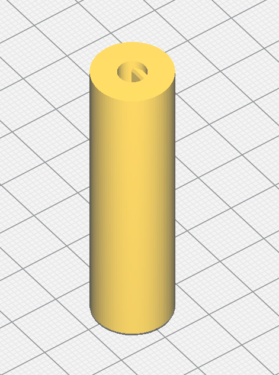
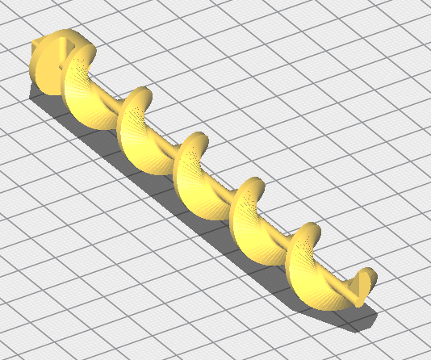
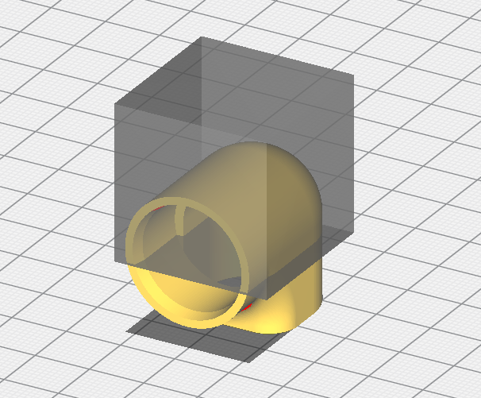

# Auger Assembly

The auger assembly is made up of 5 parts:  A stepper motor, the auger coupler, the auger, the tube, and the auger end.

### Stepper Motor

A 28BYJ-48 stepper motor is used to drive the auger.

### Auger Tube

The tube used for the auger is this part from McMaster:  https://www.mcmaster.com/8627K189/

It will need to be cut to length, and a hole will need to be drilled in it.

TODO:  Add cut and drill dimensions

### auger coupler.stl

The auger coupler connects the stepper motor to the auger.  Print this part without supports in the orientation shown below. 

### auger.stl

Print this part with supports, in the orientation shown below.  I had the best results with 0.1mm layer height.  You may need to use sandpaper to finish this part so it fits in the tube correctly.  You may also need to finish the square boss so that it fits in the auger coupler correctly.  Glue these two parts together once you're happy with how they fit in the tube.

### Auger End

Print this part in the orientation shown below, with supports, and a support blocker as shown below.

