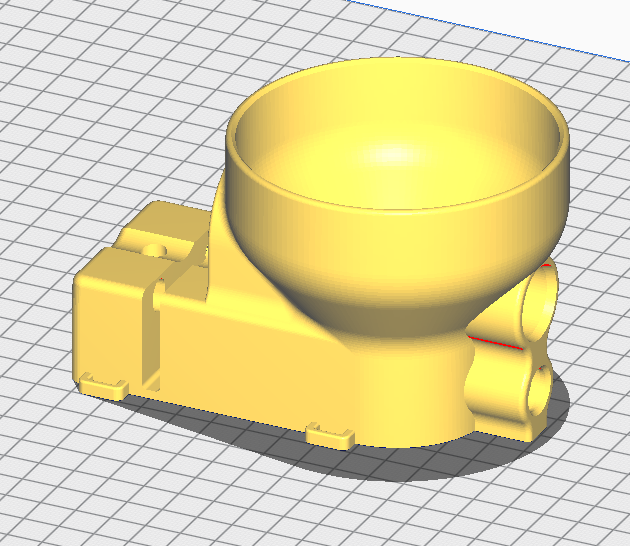

# Main Body 

This is the main body of the trickler/dispenser assembly.

At the rear of the part are 3 threaded holes.  You may need to chase these holes with a tap to clean them up.
On the side of the part, there is a hole for a bolt that locks the body to the 1/4" rod in the stand. Use a 1.25" long 1/4" hex head bolt.
Looking at the rear of the part, there are two holes.  The one on the left is for a jack screw.  Use a 1.25" long 1/4" hex head bolt.
The one on the right is for a clamping screw.  Use a 1.5" long 1/4" hex head bolt.
Use these two bolts to adjust the angle of the body so that the trickling tube dispenses properly.

On the side of the part are two loops.  These are for securing the vibration motor wires with zipties.

Looking at the front of the part, there are two holes.  The top is for the auger assembly, the bottom is for the trickler tube.

Inside the bottom hole are two grooves for o-rings to allow the trickler tube to vibrate freely.  Use orings that fit these dimensions: https://www.mcmaster.com/9452K172/

 

### lid.stl

Print this part without supports, in the orientation shown below.  

