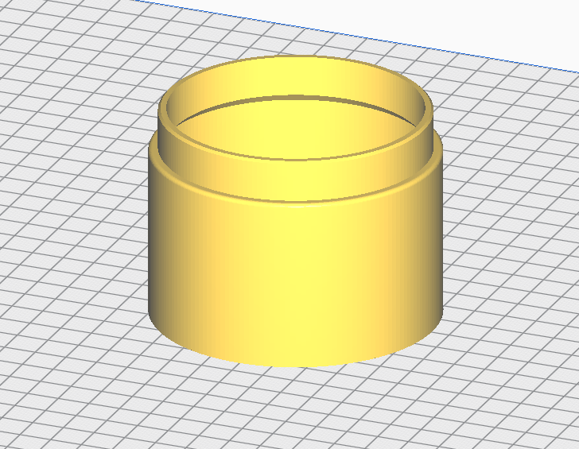

# Hopper

This can be installed onto the top of the funnel to increase the capacity of the powder dispenser assembly.  Multiples of these can be printed and stacked on top of each other.

### hopper.stl

Print this part without supports, in the orientation shown below.  

