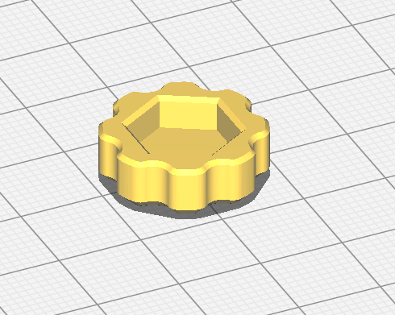

# Knobs

The powder dispenser assembly uses 1/4" hex bolts in a few locations.  These knobs make the bolts easier to adjust by hand, vs using a wrench.

### knob.stl

Print this part without supports, in the orientation shown below.  

