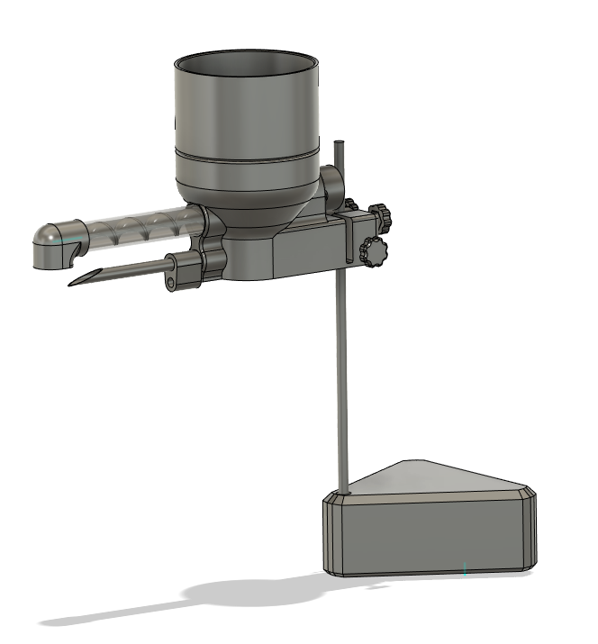

# 3D Printed Powder Dispenser Assembly

Note:  This is a work in progress.  The parts here haven't been fully tested.  Every 3d printer has slight variations, the parts you print may need some slight adjustments to fit properly.

Included in this directory are all of the parts required to 3d print your own powder dispenser assembly.  You'll find both .stl and .step file types. If you make any changes to the parts, you'll need to do the following:

1.  Include both .step and .stl file versions.
2.  Since a code review cannot be done; in your PR, include a detailed description of what you changed, and what you did to test your changes.  Do not create a PR unless you have thoroughly tested your changes.

