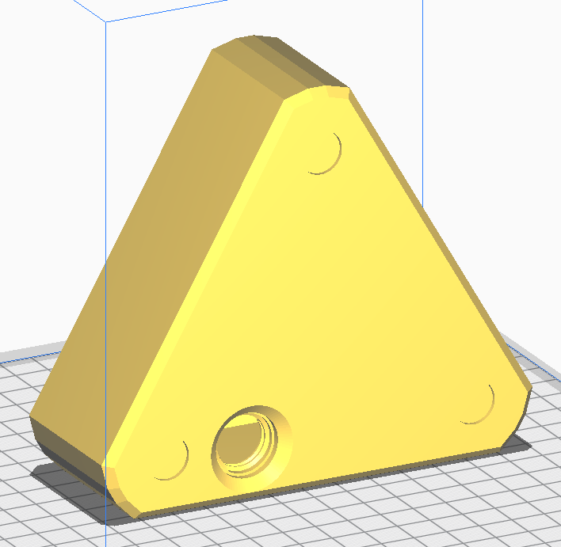
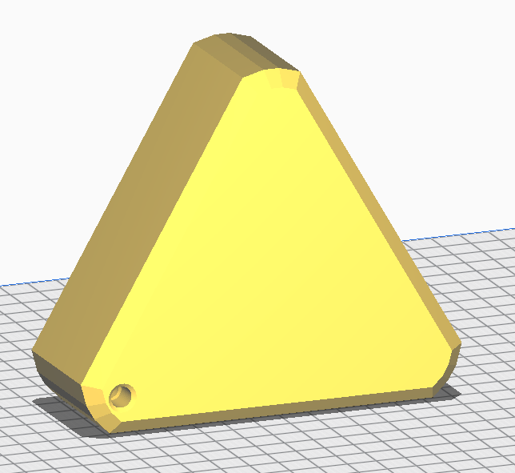
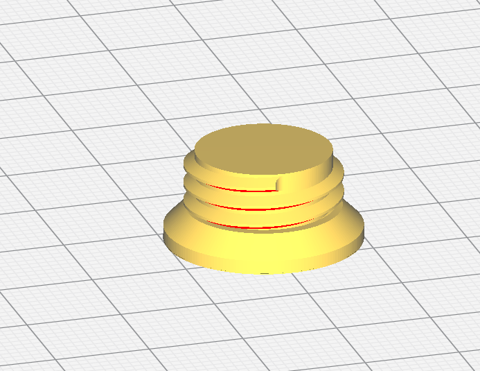

# Powder Dispenser Stand

This stand can be used for both the powder dispenser and the dropper powder dropper assembly.

There are two parts: A base and a plug.  The plug screws into the bottom of the hollow stand, which can be filled with lead shot or bullets to weigh down the stand.

The hole in the top of the base is for a 1/4" rod.  The hole may need to be cleaned up with a drill bit for the rod to fit properly.  

The bottom of the base has a threaded hole for the base plug.  You may need to clean up these threads for the plug to fit properly, depending on your print settings.  I had good results with 0.2mm layer height and no supports.

The bottom of the base has recesses for rubber feet, 1/4" in diameter.  These are not required, but I strongly suggest using them to prevent the stand stationary.  These are the ones I used, there are lots of options available:  https://www.amazon.com/gp/product/B088T7XMCY

### base.stl

Print this part without supports, in the orientation shown below.  

### base plug.stl

Print this part without supports, in the orientation shown below.

0.1mm layer thicknes will give you the best results.  If the plug does not fit in the base, even after cleaning up the threads in the base, you can scale the plug down until it does fit.  

