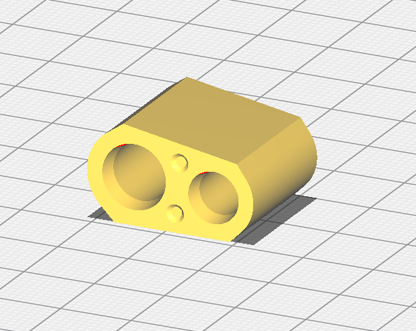

# Vibration Motor Holder

The vibration motor is held onto the trickling tube using this part.  

One end has a taper on the two holes.  This end is marked by two small dimples. Insert the motor and tube into this end.  The motor will stop against a ridge in the hole, insert it until it comes to a stop.  If the motor needs to be removed, push it out from the end with the counterweight.  Do not pull the motor out by the wires.

### vibration motor holder.stl

Print this part without supports, in the orientation shown below.  I had best results with 0.1mm layer height.

