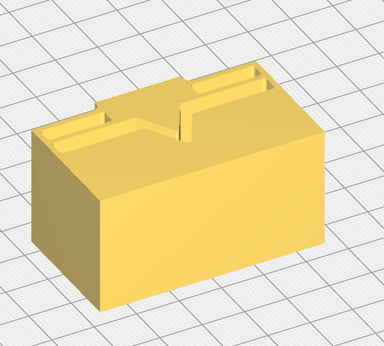
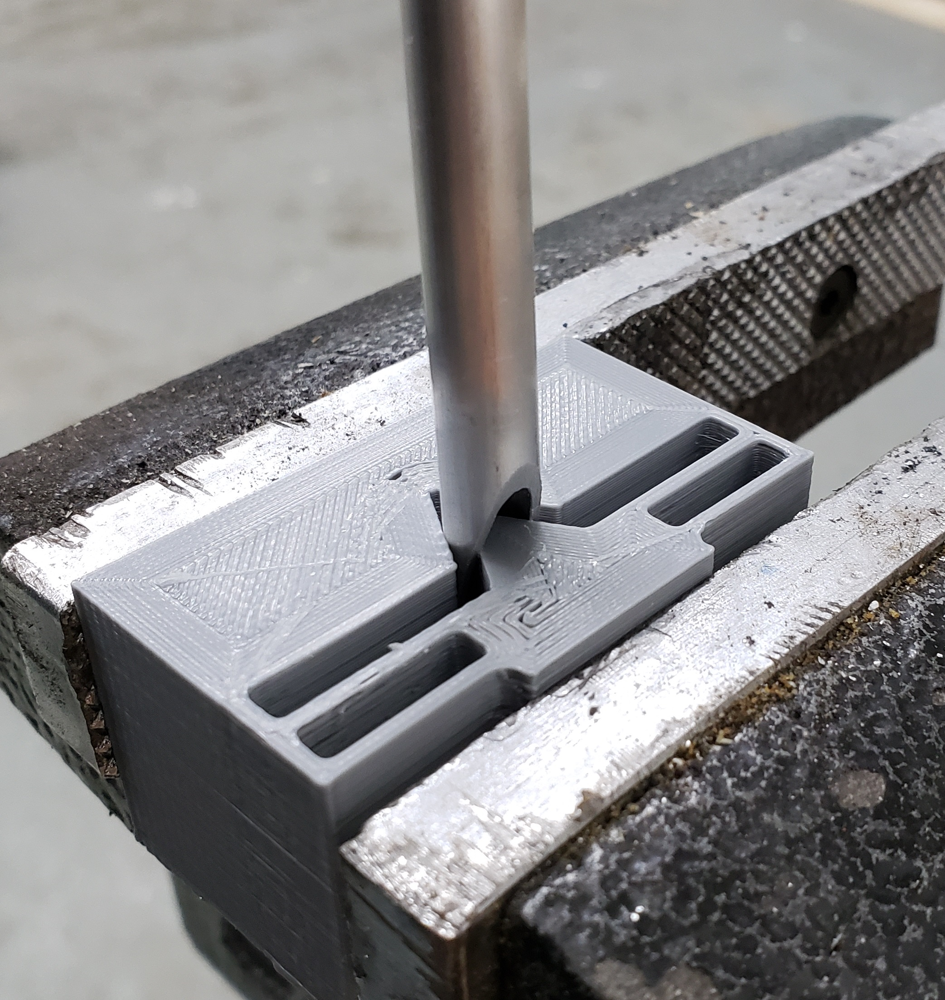
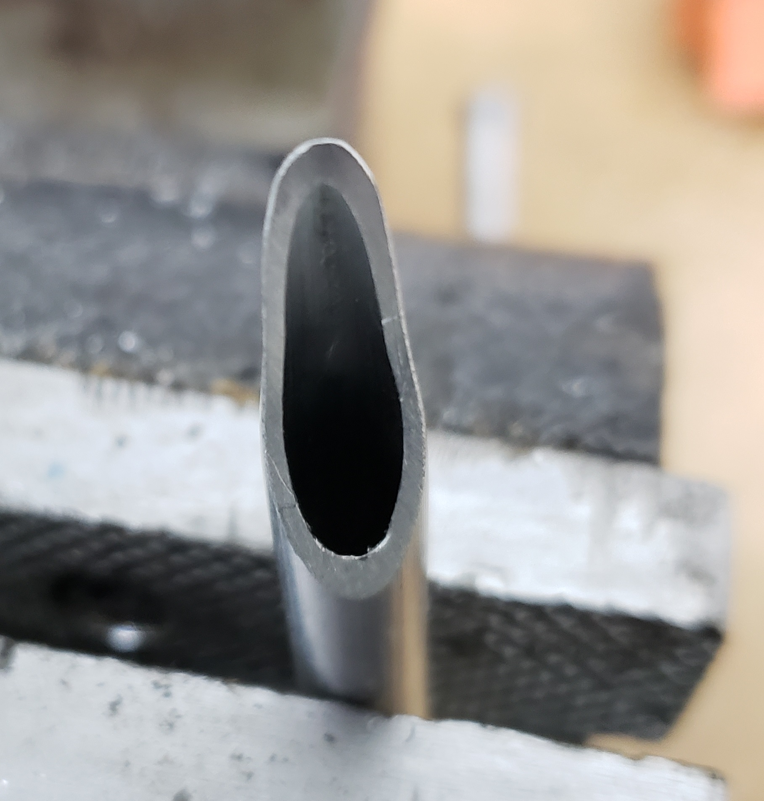
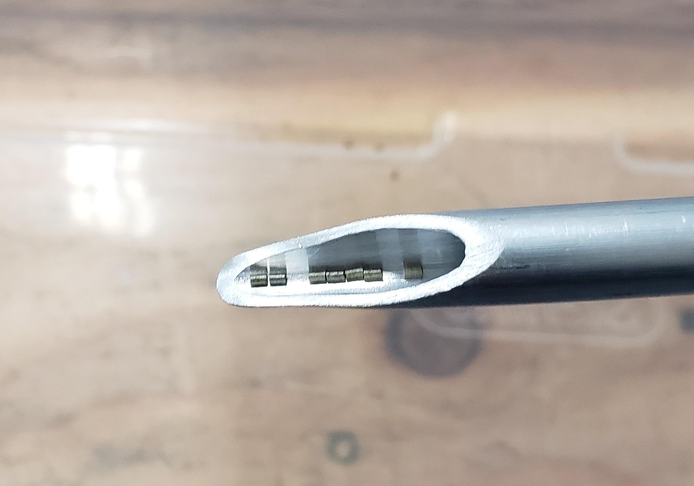

# Trickler Tube Bending Jig

This jig can be 3d printed and used to make a crimped end on the trickler tube that you previously cut a bevel on.

Orient the part on your print bed as shown in the picture below.  Print this part without supports.  You'll be pressing this  print in a vise, so I suggest printing it with many walls (I used 10)

Clamp the jig in a vise, with the tube in place, as shown below.  Then close the jaws on the vise until the desired amount of crimp is applied.

This particular tube has a relatively thick wall, so this is about as much as I was able to crimp it.  A thinner wall tube would have a sharper crimp.

Even with the thicker walled tube, the granules of powder align as you'd want them to.

