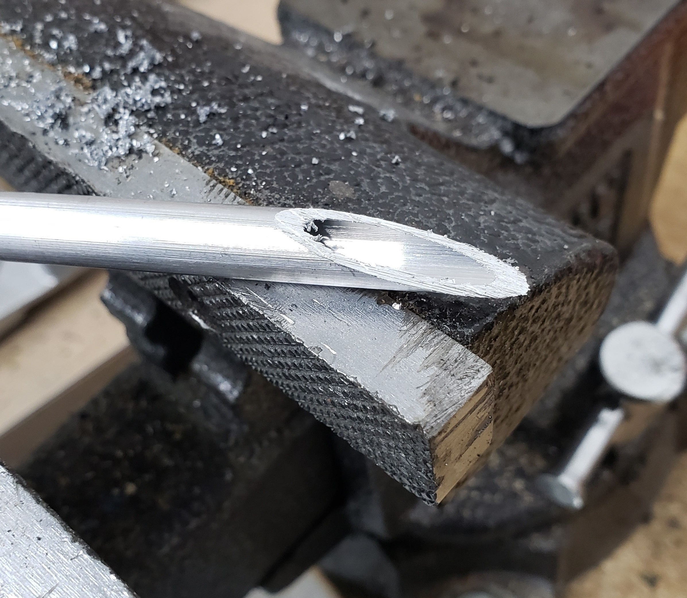

# Trickler Tube Cutting Jig

This jig can be 3d printed and used to make a beveled cut on the end of your trickling tube.

Orient the part on your print bed as shown in the picture below.  Print this part without supports.

Clamp the tube in the jig in a vise, as shown in the picture below.

Cut the tube with a hacksaw, using the slot in the jig as a guide.

Remove the tube, but be careful, the edges are sharp.

Clean up the edges with sandpaper.

